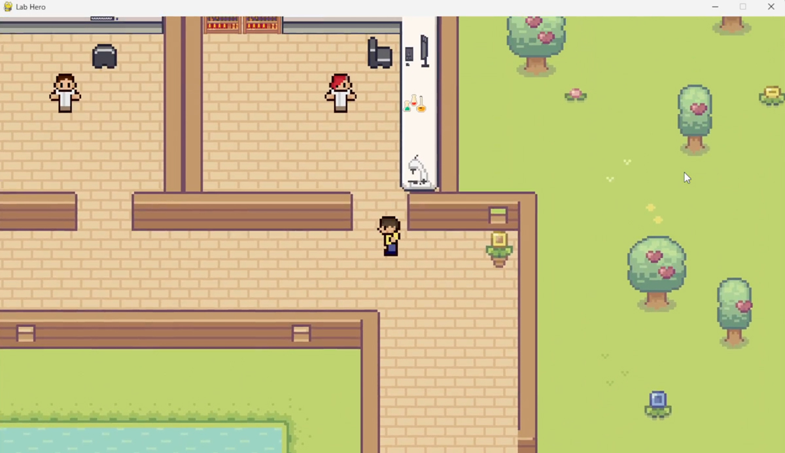

# LabHero

A serious game that empowers non-bioinformaticians to learn how to use genome-scale metabolic models.

The game consists of simulating distinct environmental and genetic modifications of towards specific objectives. At each game level, the player is required to define a strategy that encompasses selecting a medium and/or choosing genetic modifications to achieve a certain result.


## Table of Contents

 1. [Introduction](#introduction)
 2. [Installation](#installation)
 3. [Game Story](#game-story)
 4. [Controls](#controls)
 5. [Playing LabHero](#playing-labhero)


## Introduction

This game was developed as a part of the master's thesis of Mónica Leiras "Development of a serious game to stimulate the learning of genome-scale metabolic modeling concepts" (MSc in Bioinformatics - University of Minho).

## Installation

### Download Executable:

[Download for Windows](https://drive.google.com/file/d/1kPUM-_Je9yLfV1HENsKc2g-eleRCFrAv/view?usp=share_link)

[Download for macOS](https://drive.google.com/file/d/1hiQkAJ3eCTnbnxp-3bDpbzk9-DYZTnEt/view?usp=share_link)


<details>
  <summary>"Not Safe" Warning Instructions</summary><br>
  
When you try to open the application, you may see a message like this: <br>

> "This app cannot be opened because it is from an unidentified developer."

To open the game anyway, you only need to do this the first time:

#### For Windows Users:

Click "More info" on the dialog box. Then click the "Run anyway" button.

#### For macOS Users:

On your Mac, choose Apple menu > System Settings, then click Privacy & Security in the sidebar. (You may need to scroll down.) 
Go to Security, then click Open. Click Open Anyway.

#### Why Does This Happen?
The warning appears because the application is not signed with an official developer certificate. Signing software requires purchasing a certificate, which is a common practice for large-scale or commercial projects to prove their apps are legit, but it can be expensive. Since this is a smaller project, I haven’t gone through that process.


</details>

<br>

<details>
<summary>Download from GitHub</summary>
<br>

LabHero was tested with Python 3.10.11. It's recommended to use this version or a compatible one to ensure everything works smoothly.

1. Clone Repository
    ```bash
    git clone https://github.com/mleiras/LabHero.git
    ```
2. (Recommended) Set up virtual environment
    ```bash
    python3 -m venv .venv
    ```
    
    Windows:
    ```bash
    .venv\Scripts\activate
    ```
   
   macOS/Linux:
    ```bash
    source .venv/bin/activate
    ```

2. Install requirements
    ```bash
    pip install -r requirements.txt
    ```
3. Run file LabHero.py.
    ```bash
    python3 LabHero.py
    ```

    **Note:** If `python3` doesn’t work, try `python` instead.

</details>


## Game Story 

You’re a bioinformatician working at the University. You have a desk in the office of the Bioinformatics Department, where you can chat and socialize with your fellow bioinformaticians about the various projects they work on.

Your job is to help fellow researchers with the various problems they encounter during their projects. In the labs, you’ll find various missions in the field of systems biology and metabolic modeling. To complete these missions you’ll need to talk to the researchers and understand the challenges they face.

You will quickly find yourself having to carry out simulations with different environmental and genetic conditions, as suggested by the researchers, in order to obtain results more quickly. 

You can also study and learn more about systems biology and metabolic modeling with books you’ll find in your office library to help you complete the missions.

Welcome to LabHero!


## Controls

**Moving:**

Use arrows (up, down, left, righ) or WASD keys to move the character.

**Interacting:**

Use ENTER key to open the dialogue when close to another character.

Use ESCAPE key to close the dialogue with another character.

Use ENTER key to open the simulation window when close to your desk.

Use ENTER key to consult books when close to the library.

Use ENTER key to take an apple from a tree, because why not?

Use ENTER key to try some coffee and see if it has some effect on you.


**Buttons:**

Use the Mouse to click on the buttons of the dialogues and simulation menu.

**Main Menu:**

Use M key to open the Main Menu to change your name, control the music/volume, save/exit the game and to see this tutorial again.

## Playing LabHero

[](https://www.youtube.com/watch?v=ky_Ov7gZDlg)
