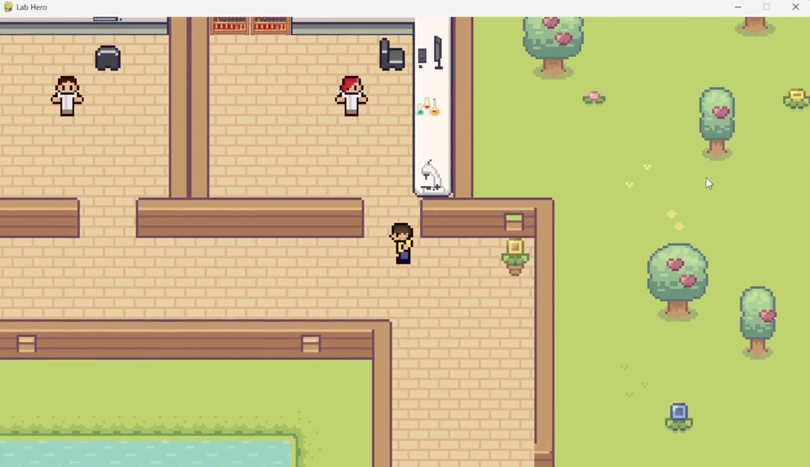

# LabHero

A serious game that empowers non-bioinformaticians to learn how to use genome-scale metabolic models.

The game consists of simulating distinct environmental and genetic modifications of towards specific objectives. At each game level, the player is required to define a strategy that encompasses selecting a medium and/or choosing genetic modifications to achieve a certain result.


## Table of Contents

 1. [Introduction](#introduction)
 2. [Installation](#installation)
 3. [Game Story](#game-story)
 4. [Controls](#controls)
 5. [Playing LabHero](#playing-labhero)


## Introduction

This game was developed as a part of the master's thesis of Mónica Leiras "Development of a serious game to stimulate the learning of genome-scale metabolic modeling concepts" (MSc in Bioinformatics - University of Minho).

## Installation

The easiest way to play is to download the latest build from the [Releases page](https://github.com/mleiras/LabHero/releases/latest).

### Windows

1. Download `LabHero-v0.1.0-windows.zip` from the latest Windows release.
2. Extract the zip anywhere on your machine.
3. Double-click `LabHero.exe` to play.

Save files are written to `%APPDATA%\LabHero\` so they persist across game updates.

### macOS (Apple Silicon)

LabHero ships as a native build for Apple Silicon Macs (M1, M2, M3, M4 — most Macs sold since late 2020). To check your Mac: Apple menu → About This Mac, look for "Chip: Apple M…".

1. Download `LabHero-v0.1.0-macos-arm64.zip` from the latest macOS release.
2. Extract the zip and drag `LabHero.app` to your Applications folder (or anywhere you like).
3. Double-click `LabHero.app` to play.

Save files are written to `~/Library/Application Support/LabHero/`.

Using an Intel-based Mac? A native Intel build is not currently packaged. Follow the "Run from source" instructions below.

<details>
  <summary>"Not Safe" Warning Instructions</summary><br>

When you try to open the application, your operating system may show a warning. This appears because the executable is not signed with a developer certificate. Signing software requires a paid certificate, which is standard for commercial projects but disproportionate for a small academic project. You only need to override this on the first launch; the system remembers your choice afterwards.

**Windows:**

1. Click "More info" on the dialog box.
2. Click the "Run anyway" button.

**macOS:**

The first time you double-click `LabHero.app`, macOS will block it with a message like *"Apple could not verify 'LabHero' is free of malware"*. To allow it:

1. Click **Done** to dismiss the warning.
2. Open **System Settings** (Apple menu → System Settings).
3. Go to **Privacy & Security** in the sidebar and scroll down to the **Security** section near the bottom.
4. You'll see *"LabHero was blocked to protect your Mac"*. Click **"Open Anyway"** next to it and confirm with your Mac password or Touch ID.
5. Go back to Finder and double-click `LabHero.app` again. A new dialog appears with an **"Open Anyway"** button. Click it.

The game will launch. From then on, double-clicking `LabHero.app` works normally.

</details>

<br>

<details>
<summary>Run from source</summary>
<br>

LabHero was tested with Python 3.10.11. Newer Python versions (3.13+) work but may need a workaround for the pinned MEWpy version.

1. Clone the repository:
    ```bash
    git clone https://github.com/mleiras/LabHero.git
    cd LabHero
    ```
2. (Recommended) Set up a virtual environment:
    ```bash
    python3 -m venv .venv
    ```

    Windows:
    ```bash
    .venv\Scripts\activate
    ```

    macOS/Linux:
    ```bash
    source .venv/bin/activate
    ```

3. Install requirements:
    ```bash
    pip install -r requirements.txt
    ```

4. Run the game:
    ```bash
    python3 LabHero.py
    ```

   **Note:** If `python3` doesn't work, try `python` instead.

</details>

## Game Story 

You’re a bioinformatician working at the University. You have a desk in the office of the Bioinformatics Department, where you can chat and socialize with your fellow bioinformaticians about the various projects they work on.

Your job is to help fellow researchers with the various problems they encounter during their projects. In the labs, you’ll find various missions in the field of systems biology and metabolic modeling. To complete these missions you’ll need to talk to the researchers and understand the challenges they face.

You will quickly find yourself having to carry out simulations with different environmental and genetic conditions, as suggested by the researchers, in order to obtain results more quickly. 

You can also study and learn more about systems biology and metabolic modeling with books you’ll find in your office library to help you complete the missions.

Welcome to LabHero!


## Controls

**Moving:**

Use arrows (up, down, left, righ) or WASD keys to move the character.

**Interacting:**

Use ENTER key to open the dialogue when close to another character.

Use ESCAPE key to close the dialogue with another character.

Use ENTER key to open the simulation window when close to your desk.

Use ENTER key to consult books when close to the library.

Use ENTER key to take an apple from a tree, because why not?

Use ENTER key to try some coffee and see if it has some effect on you.


**Buttons:**

Use the Mouse to click on the buttons of the dialogues and simulation menu.

**Main Menu:**

Use M key to open the Main Menu to change your name, control the music/volume, save/exit the game and to see this tutorial again.

## Playing LabHero

[](https://www.youtube.com/watch?v=ky_Ov7gZDlg)
